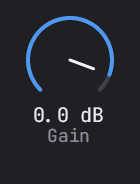

# Geckos Audio Plugins

*Faster, more precise recording*

## Overview

### Meter

<table>
<tr>
<td width="50%" valign="top">

Easy & precise metering for input monitoring, recording pristine sound

</td>
<td width="50%">

</td>
</tr>
</table>

### Tuner

<table>
<tr>
<td width="50%" valign="top">

A real-time vocal pitch tracking application that accurately detects and visualizes the pitch of your voice with minimal latency

</td>
<td width="50%">

</td>
</tr>
</table>

## Contributors

